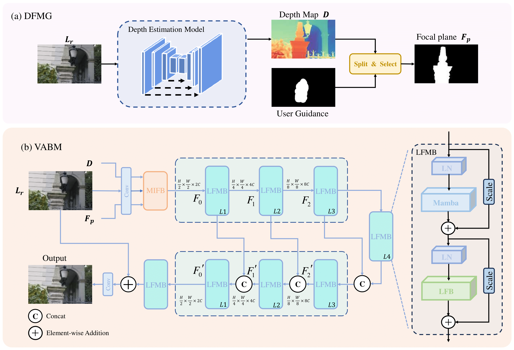
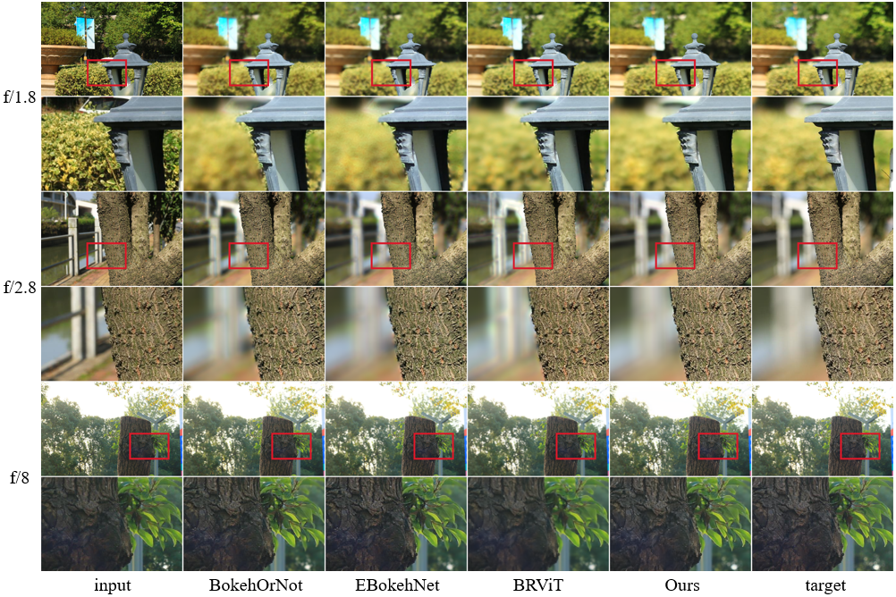
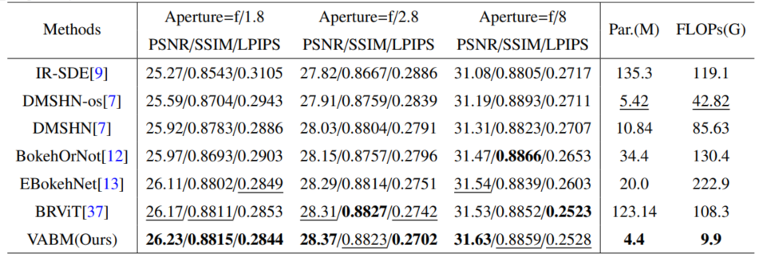

# Variable Aperture Bokeh Rendering via Customized Focal Plane Guidance

Kang Chen, Shijun Yan, Aiwen Jiang, Han Li, Zhifeng Wang, "Variable Aperture Bokeh Rendering via Customized Focal Plane Guidance", arXiv, 2024 

[](https://arxiv.org/abs/2410.14400)

> **Abstract:** Bokeh rendering is one of the most popular techniques in photography. It can make photographs visually appealing, forcing users to focus their attentions on particular area of image. However, achieving satisfactory bokeh effect usually presents significant challenge, since mobile cameras with restricted optical systems are constrained, while expensive high-end DSLR lens with large aperture should be needed.  Therefore, many deep learning-based computational photography methods have been developed to mimic the bokeh effect in recent years. Nevertheless, most of these methods were limited to rendering bokeh effect in certain single aperture. There lacks user-friendly bokeh rendering method that can provide precise focal plane control and customised bokeh generation. There as well lacks authentic realistic bokeh dataset that can potentially promote bokeh learning on variable apertures. To address these two issues, in this paper, we have proposed an effective controllable bokeh rendering method, and contributed a Variable Aperture Bokeh Dataset (VABD). In the proposed method, user can customize focal plane to accurately locate concerned subjects and select target aperture information for bokeh rendering. Experimental results on public EBB! benchmark dataset and our constructed dataset VABD have demonstrated that the customized focal plane together aperture prompt can bootstrap model to simulate realistic bokeh effect. The proposed method has achieved competitive state-of-the-art performance with only 4.4M parameters, which is much lighter than mainstream computational bokeh models.



## Effect on VABM

Visual comparison of previous classical models on the VABD dataset. From left to right, the original image with an aperture size of f/16, IR-SDE, BokehOrNot, EBokehNet , our VABM, and the target image . To facilitate the comparison between model performances, the three apertures are taken from the same scene and angle, and from top to bottom are images with aperture sizes of (f/1.8), (f/2.8), and (f/8), respectively. The results are better when viewed enlarged.



Under single-target apertures, quantitative comparison of the performance and parameters with mainstream SOTA models on VABD dataset from
all-in-focus image (of aperture f/16.0) to different bokeh effects (of respective apertures f/1.8, f/2.8, and f/8.0). The best and second-best results are highlighted and
underlined, respectively.



## Bokeh Dataset
Variable Aperture Bokeh Dataset ([VABD](https://drive.google.com/drive/folders/1iU2gkREm61B3SkhPJsFl46Pa_gA3xaBD?usp=drive_link))

The image was taken by a Canon EOS 70D with an image sensor width and height of 22.5×15mm, a focal length of 50mm, and four different apertures (f/1.8, f/2.8, f/8.0 and f/16.0).
 
The depth map is obtained through ([Depth-Anything-V2](https://github.com/DepthAnything/Depth-Anything-V2))

The VABD dataset needs to be placed according to the following directory structure:

```
└───Data
    └───VABD
        ├───test
        │   ├───1_8
        │   ├───2_8
        │   ├───8
        │   ├───focal
        │   ├───depth
        │   └───input
        └───train
            ├───1_8
            ├───2_8
            ├───8
            ├───focal
            ├───depth
            └───input
```


Everything is Better with Bokeh!([EBB!](https://competitions.codalab.org/competitions/24716))

The EBB! dataset needs to be placed according to the following directory structure:

```
└───Data
    └───EBB!
        ├───test
        │   ├───depth
        │   ├───focal
        │   ├───input
        │   └───target
        └───train
            ├───depth
            ├───focal
            ├───input
            └───target
```


## Citations
If our code helps your research or work, please consider citing our paper.
The following are BibTeX references:

```
@article{chen2024variable,
  title={Variable Aperture Bokeh Rendering via Customized Focal Plane Guidance},
  author={Chen, Kang and Yan, Shijun and Jiang, Aiwen and Li, Han and Wang, Zhifeng},
  journal={arXiv preprint arXiv:2410.14400},
  year={2024}
}
```
